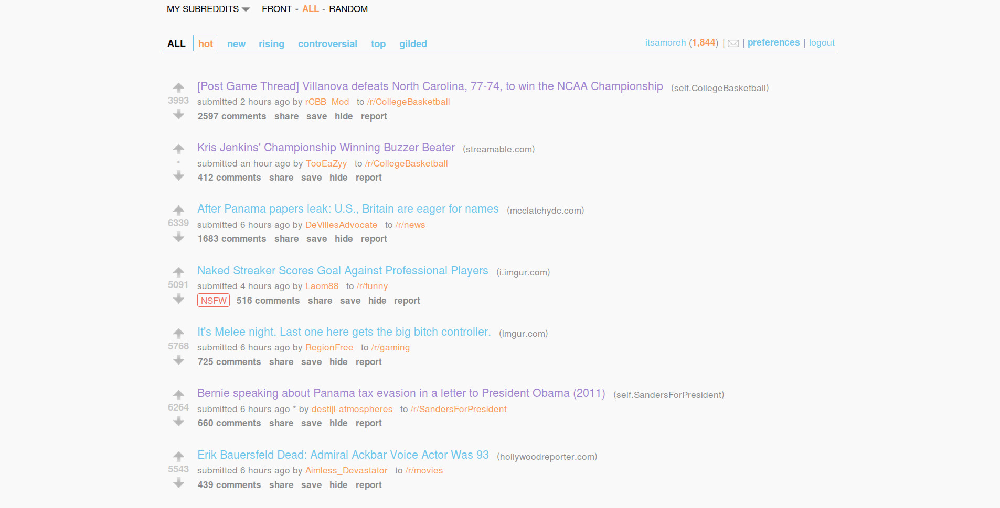
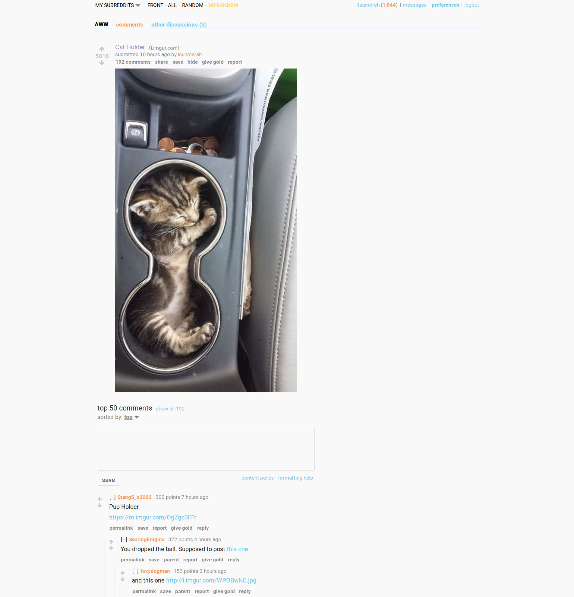

# reddit-no-frills

Very simple, clean reddit theme. I got sick of reddit being ugly and decided to make this!

Add code to a usertheme or [install with stylish here](https://userstyles.org/styles/126393/reddit-no-frills).

Make sure to turn subreddit styles off on reddit (settings > display > allow subreddits to show me custom themes). Or edit the theme to make it only apply to your frontpage.

**I've disabled the sidebar completely because I never use it. You can submit a post by going to [reddit.com/submit](http://reddit.com/submit)**

# Screenshots

